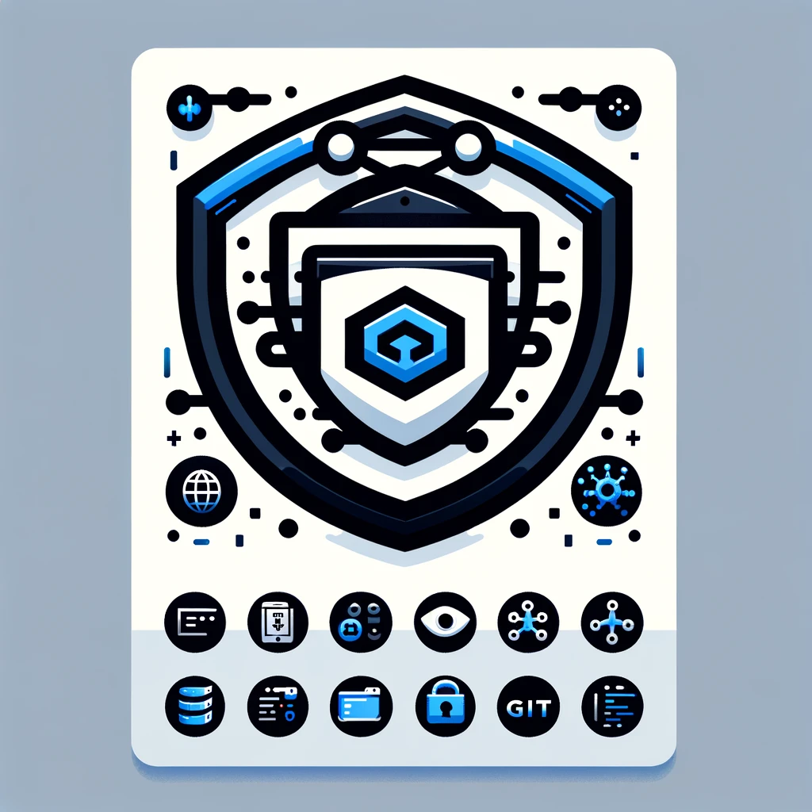

 

  
    

  

 

  

  
 
 

  <strong>Hi, I'm Zvi! 👋</strong>
  
A passionate technologist with 8+ years at <a href="https://bulwarx.com">Bulwarx</a>, where I've journeyed through roles from Professional Services Engineer to Head of Technologies. My path has been one of constant learning and applying a broad spectrum of technologies, from information security to innovative DevOps practices.

  
  
Driven by my passion for efficiency and innovation, I'm currently immersing myself in the world of DevOps, leveraging my extensive background to integrate, automate, and optimize development and operational workflows. Let's explore the future of technology together.

  

  

 

<h2 align="center"><strong>🌟 Skills Showcase 🌟</strong></h2>

  <h3>Core Expertise</h3>
  <!-- Highlighting DevOps tools -->
  
<em>DevOps & Cloud Infrastructure:</em> Proficient in automating and optimizing critical deployments using Docker, Kubernetes, Terraform, and Ansible, with hands-on experience in cloud environments like Azure and AWS.

  <h3>Comprehensive Technology Stack Knowledge</h3>
  <!-- Elaborating on the wide range of technologies -->
  
<em>Software Development & Security:</em> Versatile in multiple programming languages including Python and JavaScript, with a strong foundation in security practices across web security, data loss prevention, and email security.

  
<em>Systems Integration & Network Architecture:</em> Experienced in crafting and implementing robust solutions with technologies like load balancers, databases, and monitoring tools to ensure seamless system operations.

  <h3>Professional Leadership and Instruction</h3>
  <!-- Mention teaching and leadership roles -->
  
<em>Instruction & Team Leadership:</em> Proven track record as an effective instructor and leader, guiding teams and teaching courses on DLP, Web Security, and Email Administrators while fostering professional growth and innovation within teams.

  <!-- Additional skills related to DevOps -->
  <h3>DevOps Tools & Technologies</h3>
  
Here are some of the tools and technologies I've been working with recently:

	<code></code>
	<code></code>
	<code></code>
	<code></code>
	<code></code>
	<code></code>
	<code></code>
	<code></code>
	<code></code>
	<code></code>
	<code></code>
	<code></code>
	<code></code>
	<code></code>
	<code></code>
	<code></code>
	<code></code>
	<code></code>
	<code></code>
	<code></code>
	<code></code>
	<code></code>
	<code></code>

 

<h2 align="center">🏆 Github Stats 🏆</h2>

<table width="100%">
  <tr>
    <td valign="top" width="50%">
      
    </td>
    <td valign="top" width="50%">
      
    </td>
  </tr>
</table>

 
 

  

